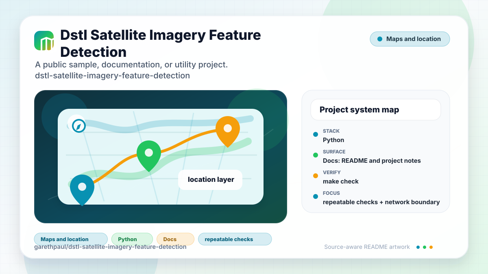

# dstl-satellite-imagery-feature-detection

<!-- README-OVERVIEW-IMAGE -->


## Overview

`garethpaul/dstl-satellite-imagery-feature-detection` is a public sample, documentation, or utility project. dstl-satellite-imagery-feature-detection https://www.kaggle.com/c/dstl-satellite-imagery-feature-detection

This README is based on the checked-in source, manifests, scripts, and repository metadata on the `master` branch. The project language mix found during review was: Python (2).

## Repository Contents

- `README.md` - project overview and local usage notes
- `docs` - source or example code
- `Makefile` - repository-level verification wrapper
- `SECURITY.md` - security reporting and disclosure guidance
- `tests` - source or example code
- `VISION.md` - project direction and maintenance guardrails

Additional scan context:

- Source directories: docs, tests
- Dependency and build manifests: none detected
- Entry points or build surfaces: Makefile, `scripts/check-baseline.sh`
- Test-looking files: tests/testutils.py

## Getting Started

### Prerequisites

- Git
- Python 3.10 or newer (CI covers Python 3.10, 3.12, and 3.14)
- Runtime and verification dependencies from `requirements.txt` and
  `requirements-dev.txt`

### Setup

```bash
git clone https://github.com/garethpaul/dstl-satellite-imagery-feature-detection.git
cd dstl-satellite-imagery-feature-detection
python3 -m pip install -r requirements.txt
python3 -m pip install -r requirements-dev.txt
```

The setup commands above are derived from repository files. Legacy mobile, Python, or JavaScript samples may require older SDKs or package versions than a modern workstation uses by default.

## Running or Using the Project

- `utils.py` downloads the configured Kaggle DSTL archives and extracts them
  into the current working directory by default.
- Downloader helpers require HTTPS download URLs on Kaggle hosts before Kaggle
  credentials are loaded or posted, and reject embedded URL credentials.
- Downloader timeouts must be positive finite values or `(connect, read)` pairs;
  disabled or invalid timeouts are rejected before requests are posted.
- Downloader helpers only accept filenames from the checked-in DSTL archive
  list before Kaggle credentials are loaded or posted.
- Downloads default to a 25 GiB maximum, while extraction defaults to 100 GiB
  and 100,000 archive members. Callers may supply different positive integer
  limits when working with known datasets.
- Cached downloads are reused only when the destination is a regular
  non-symlink file containing a non-empty ZIP archive. Newly streamed bodies
  receive the same validation before atomic promotion, and partial downloads
  are created exclusively so a concurrently inserted path cannot be followed.
- Create a local, untracked `kaggle_credentials.ini` beside `utils.py` before
  running live downloads:

```ini
[KAGGLE]
login = your-kaggle-username
password = your-kaggle-password
```

```bash
python3 utils.py
```

## Testing and Verification

Run the offline verification gate:

```bash
make check
python3 -m unittest discover -s tests -p "test*.py"
scripts/check-baseline.sh
make build
python3 -m py_compile utils.py tests/testutils.py
```

`make check` runs the source baseline, Ruff formatting and lint checks, 22
offline unit tests, bytecode compilation, and a `pip-audit` scan of declared
dependencies. Default tests use
fake HTTP responses and temporary files. They do not require Kaggle
credentials, live network access, downloaded archives, or extracted imagery.
GitHub Actions runs the same gate on Python 3.10, 3.12, and 3.14 for pushes,
pull requests, and manual dispatches.

When the required SDK or runtime is unavailable, use static checks and source review first, then verify on a machine that has the matching platform toolchain.

## Configuration and Secrets

- `kaggle_credentials.ini` is required only for live downloads and is ignored by
  git.
- Downloaded `.zip` archives and extracted imagery should stay outside commits.
- HTTPS download URLs are enforced before credentials are posted, and live
  download URLs must use Kaggle hosts without embedded URL credentials.
- Live downloads require a positive finite timeout value or `(connect, read)`
  timeout pair; passing `None` is rejected before a request is posted.
- File-loaded and supplied credentials are normalized before any request is
  posted, and blank credentials are rejected.
- Live download filenames must match the checked-in DSTL archive list.
- Zip extraction preflights every member before writing files and rejects path
  traversal, archive symlink members, and existing symlinks in destination
  paths.
- Downloads reject declared or streamed content over the configured byte
  limit, and extraction rejects archives over the configured expanded-size or
  member-count limits before writing members.
- Existing download destinations must be regular non-symlink files. Partial
  files use exclusive creation and are removed when a stream, payload check, or
  path race fails. Cached and newly downloaded files must be non-empty ZIP
  archives, preventing HTML login/error bodies from becoming reusable data.

## Security and Privacy Notes

- Review changes touching authentication or token handling; examples from the scan include tests/testutils.py, utils.py.
- Review changes touching network requests, sockets, or service endpoints; examples from the scan include docs/bugs/p2-python-http-call-without-timeout-3955c83cfecd63ea.md, tests/testutils.py, utils.py.
- Review changes touching file, media, JSON, XML, CSV, OCR, or data parsing; examples from the scan include docs/bugs/p2-python-http-call-without-timeout-3955c83cfecd63ea.md, tests/testutils.py, utils.py.

## Maintenance Notes

- See `SECURITY.md` for vulnerability reporting and safe research guidance.
- See `VISION.md` for project direction and contribution guardrails.
- See `docs/plans/2026-06-08-dstl-data-loader-baseline.md` for the current
  data-loader reliability baseline.
- See `docs/plans/2026-06-09-dstl-https-download-guard.md` for the HTTPS
  download URL guard.
- See `docs/plans/2026-06-09-dstl-kaggle-host-download-guard.md` for the
  Kaggle host download guard.
- See `docs/plans/2026-06-09-dstl-archive-allowlist.md` for the DSTL archive
  filename allow-list.
- See `docs/plans/2026-06-09-dstl-zip-symlink-guard.md` for the zip symlink
  member extraction guard.
- See `docs/plans/2026-06-09-dstl-direct-credential-validation.md` for direct
  credential validation before requests.
- See `docs/plans/2026-06-09-dstl-url-credential-guard.md` for embedded URL
  credential rejection before requests.
- See `docs/plans/2026-06-09-dstl-timeout-validation.md` for positive finite
  timeout validation before requests.
- See `docs/plans/2026-06-10-dstl-resource-and-ci-limits.md` for resource
  limits, pinned verification tooling, and the GitHub Actions gate.
- See `docs/plans/2026-06-10-dstl-download-path-boundary.md` for cached-file
  validation and exclusive partial-file creation.
- See `docs/plans/2026-06-12-dstl-download-payload-validation.md` for cached and
  streamed ZIP payload validation.

## Contributing

Keep changes small and tied to the project that is already present in this repository. For code changes, document the toolchain used, avoid committing generated dependency directories or local configuration, and update this README when setup or verification steps change.
